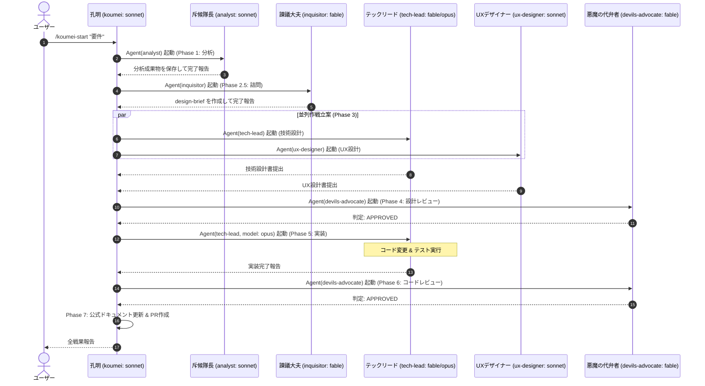
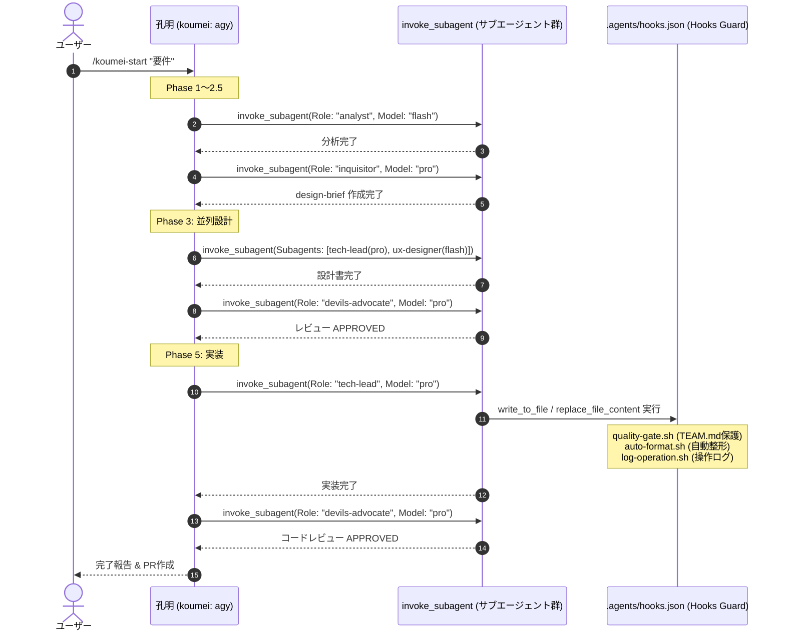
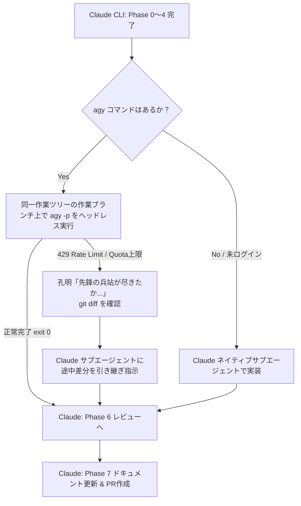

# ターゲットCLI別の実行フロー・各ロールの振る舞いガイド

本ドキュメントでは、Koumei AI Team Framework を各ターゲットCLI（`claude`, `antigravity`, `codex`）およびハイブリッド環境で実行した際の **「エージェント起動機構」「ロール間のバトンタッチ（遷移フロー）」「Hooksによる防御」** の詳細を解説します。

---

## 1. CLI別 実行メカニズム比較

| 項目 | `claude` (Claude Code) | `antigravity` (Antigravity / `agy`) | `codex` (Codex CLI) |
|---|---|---|---|
| **配置ディレクトリ** | `.claude/skills/` + `CLAUDE.md` | `.agents/skills/` + `AGENTS.md` | `.codex/skills/` + `AGENTS.md` |
| **サブエージェント起動** | `Agent` ツール（ネスト起動） | `invoke_subagent` ツール | 逐次実行 / `codex exec` |
| **モデル切り替え** | `model` 引数（`fable`, `opus`, `sonnet`） | `Model` 引数（`pro`, `flash`, `inherit`） | 単一モデル固定 |
| **並列処理（マルチタスク）** | 複数 `Agent` ツールの同時発行 | `invoke_subagent` の `Subagents: [...]` 配列 | 非対応（直列実行） |
| **Hooks（自動監査）** | `.claude/settings.json` | `.agents/hooks.json` | 非対応（lintゲートで代用） |

---

## 2. ターゲットCLIごとのロール遷移フロー

### ① `claude` ターゲット（Claude Code 実行時）

Claude Code では、オーケストレーター（諸葛孔明）が内蔵の `Agent tool` を用いて、各フェーズで独立したサブエージェント（異なるモデル）を自律的に呼び出します。

* **マルチタスク（`--multi`）**:
  孔明が `task-manager` サブエージェントを `Agent tool` で並列起動し、各 `task-manager` が独立した `git worktree` 内で上記の Phase 1〜7 パイプラインを完遂します。

---

### ② `antigravity` ターゲット（`agy` CLI 実行時）

Antigravity では、`invoke_subagent` ツールを活用し、`pro`（高推論）および `flash`（高速軽量）の階層を動的に割り当ててサブエージェントを実行します。

* **マルチタスク（`--multi`）**:
  `invoke_subagent` に `Subagents: [{Role: "task-manager-1", ...}, {Role: "task-manager-2", ...}]` の配列を渡し、**1回のツールコールで複数タスクをネイティブ並列起動**します。

---

### ③ `codex` ターゲット（Codex CLI 実行時）

Codex CLI 環境では、サブエージェントのネスト起動機構がないため、**単一セッション内でロール定義（`AGENTS.md`）を順次読み替えながらフェーズを直列実行**します。

1. **フェーズ直列進行**: 孔明が自身を各ロール（斥候 → 諫議大夫 → 設計者 → レビュアー → 実装者）に見立て、コンテキスト内で手順書を順番に実行します。
2. **レビューの厳格性**: 自己レビューの弊害を防ぐため、外部CLI呼出（`codex exec` など）で別プロセスとしてレビューを切り離すか、厳格なプロンプト規律で判定を行います。
3. **安全装置**: Hooks の代わりに `check_command`（PR前 lint/format ゲート）を用いてコード品質を担保します。

---

### ④ クロスCLI・ハイブリッド実行（Claude 司令塔 ⇄ `agy` 実装委譲）

Claude Code をメインとして使いつつ、最もトークンを消費する実装フェーズ（Phase 5）を Antigravity（Gemini）に委譲する最も経済的な構成です。

1. **隔離はブランチとコミットが担う**: 専用の作業ブランチ上で走らせ、フェーズ完了ごとに commit + push するため、委譲先が何をしても git で戻せます。**別 worktree では走らせません**（指揮者の作業ツリーで commit するため、別の場所に書かれた実装は行き場を失います）。
2. **レートリミット自律復旧**: `agy` が途中で上限に達しても、Claude が `git diff` の中間差分を引き継ぎ、残りの実装をシームレスに完遂します。
